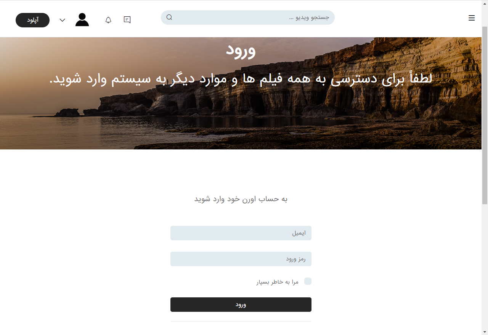
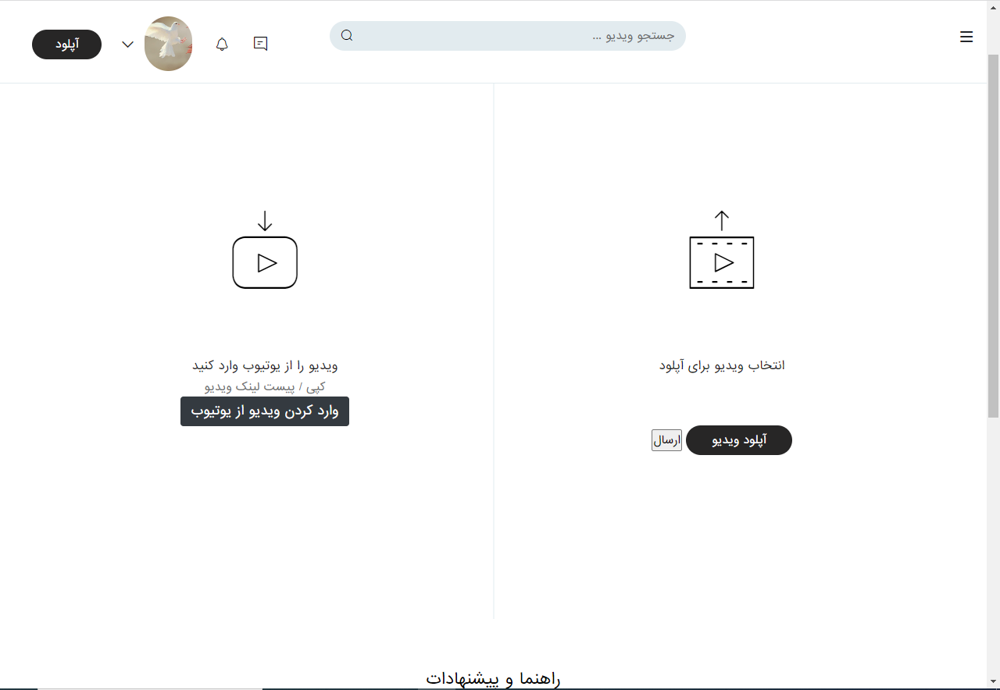
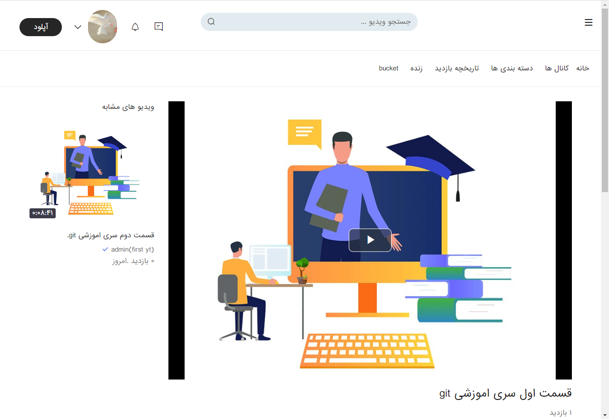
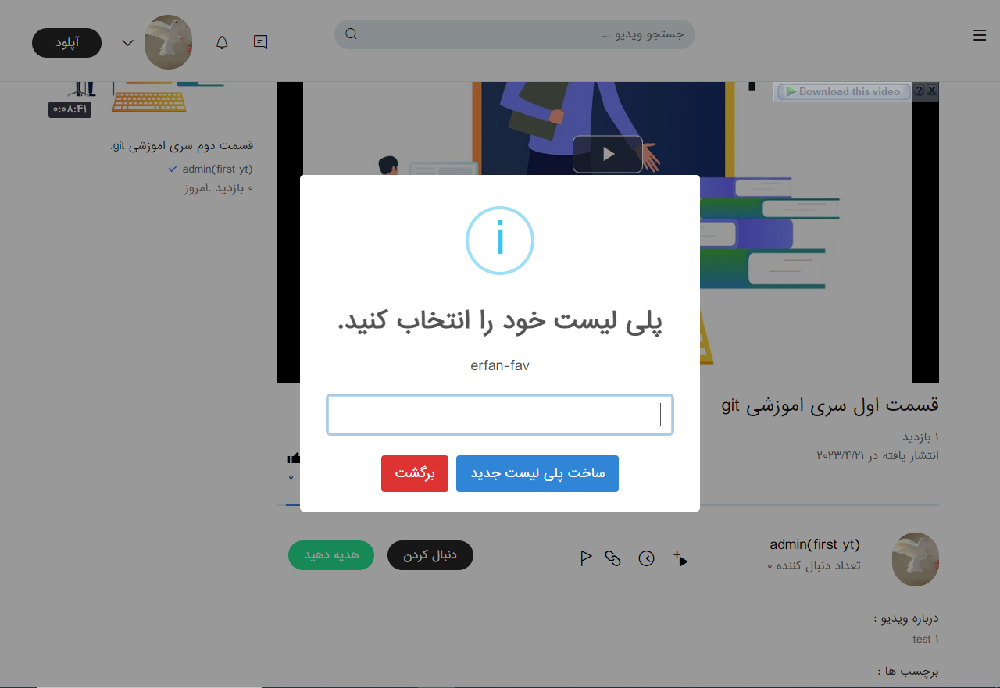

# yt_clone
 create youtube clone for more django practice , learn new things and ofcourse have fun.

## table of content 
- [technologies](#technologies)
- [startproject](#startproject)
- [site-functionality](#site-functionality)
    - [accounting](#accounting)
    - [upload-video](#upload-video)
    - [more-about-project](#more-about-project)

## technologies
<p align="center">
<a href="https://www.python.org" target="_blank">  </a>
<a href="https://git-scm.com/" target="_blank">  </a>
<a href="https://www.djangoproject.com/" target="_blank">  </a>
<a href="https://www.arvancloud.ir/fa" target="_blank">  </a>
<a href="https://docs.celeryq.dev/" target="_blank">  </a>
</p>

## startproject
```bash
git clone https://github.com/erfan-karimii/yt_clone
cd yt_clone
pip install -r requirment.txt
```
keep in mind that install these packages in venv is always good practice.
create .env file in settings.py diractory and set following variable
```bash
AWS_ACCESS_KEY_ID=your AWS_ACCESS_KEY_ID
AWS_SECRET_ACCESS_KEY=your AWS_SECRET_ACCESS_KEY
AWS_S3_ENDPOINT_URL=your AWS_S3_ENDPOINT_URL
AWS_STORAGE_BUCKET_NAME=your AWS_STORAGE_BUCKET_NAME
```
run rabbitmq with docker for celery :
```bash
docker pull rabbitmq
docker run -d rabbitmq -p 15672:15672
```
and finally start project and celery:
```bash
cd core
python manage.py runserver
celery -A core worker -P gevent -l info
celery -A core beat -l info --scheduler django_celery_beat.schedulers:DatabaseScheduler
```
Note: celery beat is run in this project but it is just for future needs

## site-functionality

### accounting
in this project i use simple email & password authentication.



every authenticate user has her own profile and can upload video

### upload-video



as the image show , users can upload video from their local device or straight from youtube (youtube section srill has its known bugs and its under development)

### more-about-project

comment section , like & dislike , create & delete play lists , add & remove video from play list, and so more ...


<br>



